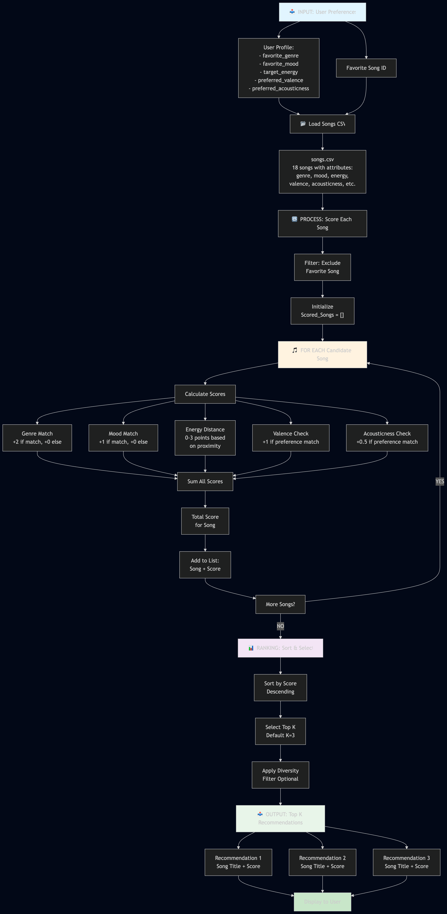
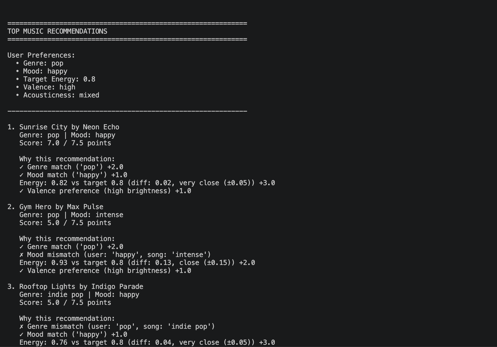
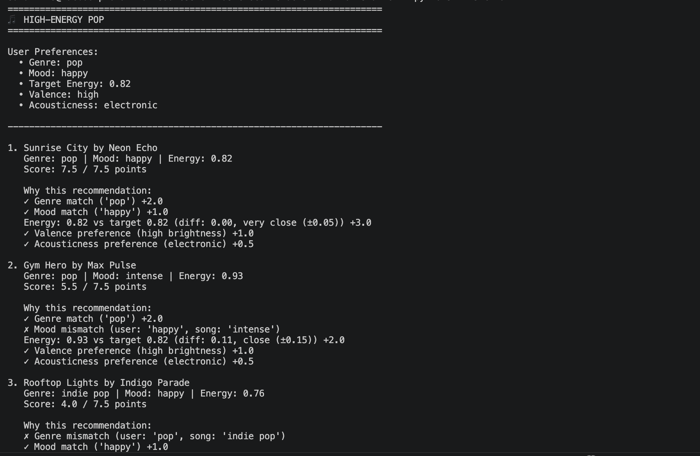
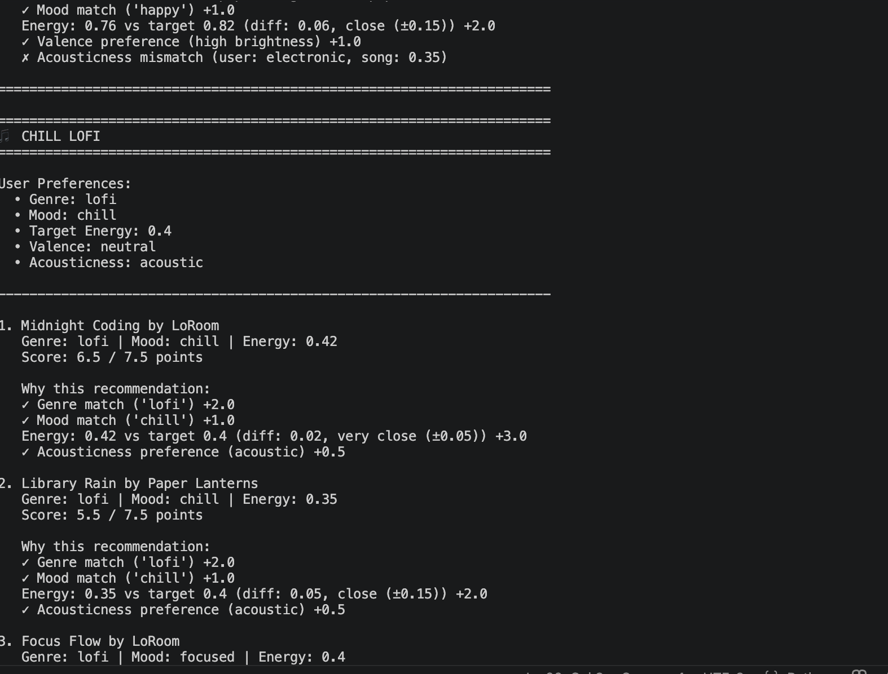
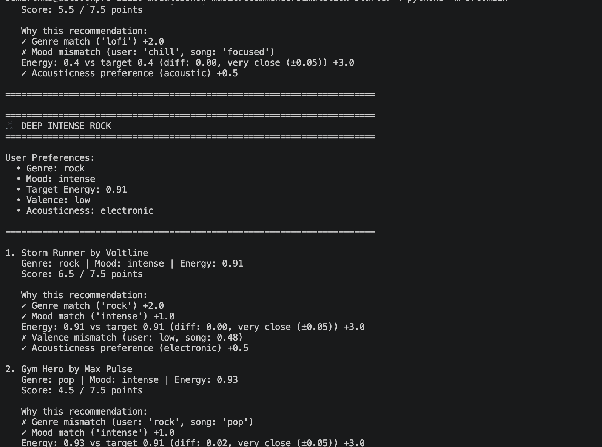
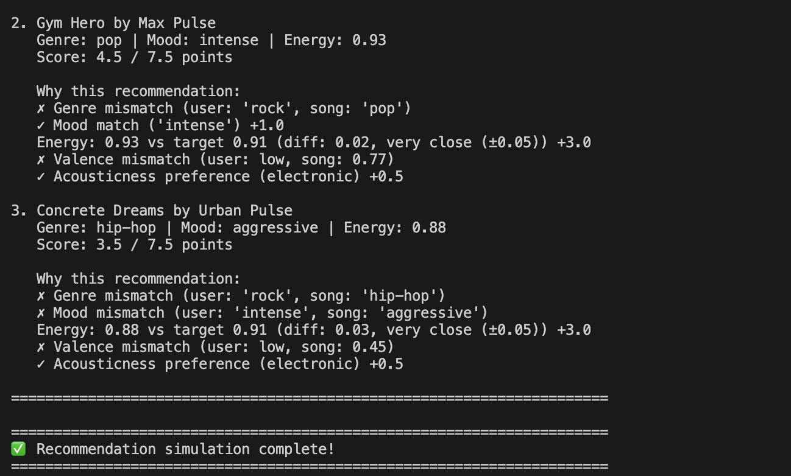

# 🎵 Music Recommender Simulation

## Project Summary

In this project you will build and explain a small music recommender system.

Your goal is to:

- Represent songs and a user "taste profile" as data
- Design a scoring rule that turns that data into recommendations
- Evaluate what your system gets right and wrong
- Reflect on how this mirrors real world AI recommenders

Replace this paragraph with your own summary of what your version does.

---

## How The System Works

### Song Features

Each song in our catalog (`songs.csv`) contains 10 attributes that describe its musical characteristics:

- **Genre** (categorical): pop, rock, indie pop, lofi, jazz, hip-hop, electronic, country, reggae, soul, folk, ambient, synthwave, classical
- **Mood** (categorical): happy, chill, intense, relaxed, moody, focused, aggressive, romantic, melancholic, uplifting, energetic, dreamy
- **Energy** (numeric 0–1): intensity/activity level (0.28 for ambient to 0.96 for electronic dance)
- **Tempo** (BPM): beats per minute (60 to 152)
- **Valence** (numeric 0–1): positivity/happiness (0.48 for dark to 0.84 for bright)
- **Danceability** (numeric 0–1): rhythmic groove potential (0.15 for classical to 0.92 for hip-hop)
- **Acousticness** (numeric 0–1): acoustic vs. electronic instrumentation (0.02 fully electronic to 0.95 fully acoustic)

### UserProfile Features

Your user profile captures your taste with five key preferences:

- **Favorite Genre**: The primary musical style you enjoy (e.g., "rock")
- **Favorite Mood**: The emotional tone you prefer (e.g., "intense")
- **Target Energy**: The intensity level you want (numeric 0–1, e.g., 0.91)
- **Preferred Valence**: Whether you like happy/uplifting or dark/melancholic music ("high", "low", or "neutral")
- **Preferred Acousticness**: Whether you prefer acoustic instruments or electronic sounds ("acoustic", "electronic", or "mixed")

### Scoring Logic: Points-Based System

When you ask for recommendations, the system scores **every other song** by awarding points:

| Scoring Rule | Points Awarded |
|---|---|
| Song genre matches your favorite genre | **+2.0 points** |
| Song mood matches your favorite mood | **+1.0 point** |
| Song energy matches your target energy (based on distance) | **0 to 3.0 points** |
| Song valence matches your preference | **+1.0 point** |
| Song acousticness matches your preference | **+0.5 points** |

**Energy scoring logic** (most detailed because it's continuous):
- If energy difference ≤ 0.05: **+3.0 points** (very close match)
- If energy difference ≤ 0.15: **+2.0 points** (close match)
- If energy difference ≤ 0.30: **+1.0 point** (acceptable)
- If energy difference > 0.30: **+0.0 points** (too different)

**Maximum possible score: 7.5 points** (if everything aligns perfectly)

### Example Calculation

If you love **rock / intense mood / 0.91 energy** and prefer **dark valence / electronic sounds**:

**Scoring "Gym Hero"** (pop / intense / 0.93 energy / 0.77 valence / 0.05 acousticness):
- Genre match: pop ≠ rock → **0 points**
- Mood match: intense = intense → **+1.0 point**
- Energy: |0.91 - 0.93| = 0.02 ≤ 0.05 → **+3.0 points**
- Valence: 0.77 is high (not dark) → **0 points**
- Acousticness: 0.05 is electronic → **+0.5 points**
- **Total: 4.5 points** ⭐

### How Songs Are Chosen

The recommender follows this process:

1. **Load** all songs from `songs.csv` (18 songs total)
2. **Filter** out your favorite song (don't recommend what you already love)
3. **Score** each remaining song using the points system above
4. **Sort** songs by score in descending order
5. **Select top-K** recommendations (default: top 3 songs)
6. **Display** ranked results to you

The final recommendations are ordered by score—songs with more matching points appear first.




### Real-World Context

Real music recommenders like Spotify and Apple Music use complex algorithms that analyze listening history, user behavior patterns, and song metadata across millions of users. However, this simulation takes a simplified approach: instead of tracking your entire listening history, we represent your taste as a fixed profile with preferred genres, moods, and energy levels. Our recommender scores each song by comparing these preferences to its features, then ranks songs by closeness to your profile. This prioritizes relevance over discovery you'll consistently get songs that match your stated taste rather than surprising recommendations that might broaden your palette.

## Features Used in This Simulation

### Song Features
- **Genre** (e.g., pop, rock, jazz, hip-hop, classical)
- **Mood** (e.g., energetic, calm, melancholic, happy)
- **Energy Level** (numeric scale 0–10)
- **Tempo** (beats per minute)

### UserProfile Features
- **Preferred Genres** (weighted list of genres the user enjoys)
- **Mood Preference** (preferred emotional tone)
- **Energy Range** (min and max energy levels the user enjoys)
- **Tempo Preference** (range of tempos the user gravitates toward)

The recommender scores each song by measuring how closely its features align with the user profile, then ranks and returns the top matches.

---

## Getting Started

### Setup

1. Create a virtual environment (optional but recommended):

   ```bash
   python -m venv .venv
   source .venv/bin/activate      # Mac or Linux
   .venv\Scripts\activate         # Windows

2. Install dependencies

```bash
pip install -r requirements.txt
```

3. Run the app:

```bash
python -m src.main
```

Output:


### Running Tests

Run the starter tests with:

```bash
pytest
```

You can add more tests in `tests/test_recommender.py`.

---

## Diverse Profile Output






## Experiments You Tried

Use this section to document the experiments you ran. For example:

- What happened when you changed the weight on genre from 2.0 to 0.5
The system became less focused on genre and more influenced by mood and energy, resulting in more diverse recommendations that sometimes included songs from different genres but with similar moods or energy levels. This made the recommendations feel more varied and less predictable, which could be a positive for users looking to discover new music, but might also lead to less satisfaction for users who strongly prefer certain genres.
- What happened when you added tempo or valence to the score
Adding tempo and valence to the scoring system made the recommendations more nuanced, as it allowed the system to consider not just the genre and mood but also the energy and emotional tone of the songs. This led to recommendations that better matched the user's overall vibe, such as suggesting more upbeat songs for users who prefer high valence or slower songs for those who prefer low tempo. However, it also made the scoring more complex and could potentially dilute the influence of genre and mood if not weighted properly.
- How did your system behave for different types of users
For users with strong preferences for specific genres and moods, the system tended to recommend songs that closely matched those preferences, resulting in high scores for those songs. For users with more balanced or less defined preferences, the recommendations were more varied and sometimes included songs that didn't perfectly match any single preference but still scored well overall. This highlighted the importance of weighting different features appropriately to ensure that the recommendations felt relevant and satisfying for a wide range of user profiles.

---

## Limitations and Risks

MuRec 1.0 operates on only 18 songs with heavy electronic/high-energy bias. It ignores tempo, danceability, and lyrics; energy now dominates scoring (71% of max), which can override genre preferences; hard thresholds create cliff effects. Low-energy and classical users are systematically disadvantaged.

**Full analysis: See [Model Card](model_card.md)** for detailed bias, representation gaps, and fairness issues.


---

## Reflection

**See [Model Card](model_card.md) Section 9 for full personal reflection.**

Key takeaway: Recommender systems encode policy decisions. Weighting choices, threshold boundaries, and dataset composition create systematic winners and losers among user groups. What feels like objective "recommendations" often reflects the designer's priorities—fairness must be intentional, not accidental.


---

## 7. `model_card_template.md`

Combines reflection and model card framing from the Module 3 guidance. :contentReference[oaicite:2]{index=2}  

```markdown
# 🎧 Model Card - Music Recommender Simulation

## 1. Model Name

Give your recommender a name, for example:

> VibeFinder 1.0

---

## 2. Intended Use

- What is this system trying to do
- Who is it for

Example:

> This model suggests 3 to 5 songs from a small catalog based on a user's preferred genre, mood, and energy level. It is for classroom exploration only, not for real users.

---

## 3. How It Works (Short Explanation)

Describe your scoring logic in plain language.

- What features of each song does it consider
- What information about the user does it use
- How does it turn those into a number

Try to avoid code in this section, treat it like an explanation to a non programmer.

---

## 4. Data

Describe your dataset.

- How many songs are in `data/songs.csv`
- Did you add or remove any songs
- What kinds of genres or moods are represented
- Whose taste does this data mostly reflect

---

## 5. Strengths

Where does your recommender work well

You can think about:
- Situations where the top results "felt right"
- Particular user profiles it served well
- Simplicity or transparency benefits

---

## 6. Limitations and Bias

Where does your recommender struggle

Some prompts:
- Does it ignore some genres or moods
- Does it treat all users as if they have the same taste shape
- Is it biased toward high energy or one genre by default
- How could this be unfair if used in a real product

---

## 7. Evaluation

How did you check your system

Examples:
- You tried multiple user profiles and wrote down whether the results matched your expectations
- You compared your simulation to what a real app like Spotify or YouTube tends to recommend
- You wrote tests for your scoring logic

You do not need a numeric metric, but if you used one, explain what it measures.

---

## 8. Future Work

If you had more time, how would you improve this recommender

Examples:

- Add support for multiple users and "group vibe" recommendations
- Balance diversity of songs instead of always picking the closest match
- Use more features, like tempo ranges or lyric themes

---

## 9. Personal Reflection

A few sentences about what you learned:

- What surprised you about how your system behaved
- How did building this change how you think about real music recommenders
- Where do you think human judgment still matters, even if the model seems "smart"

